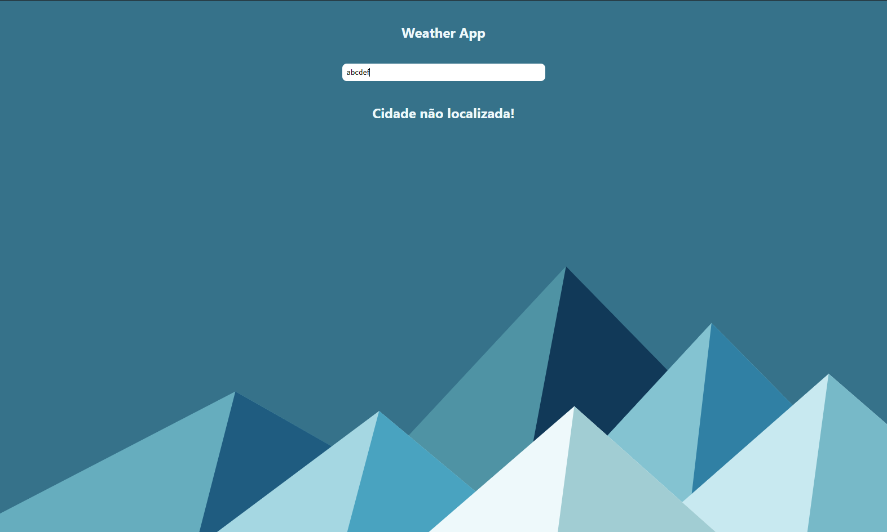
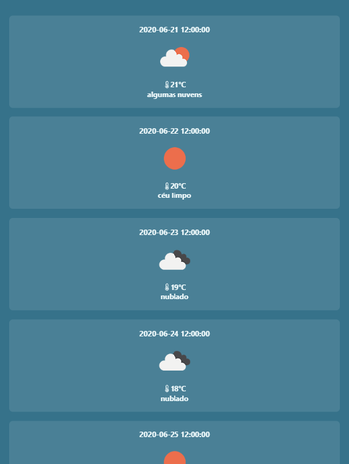
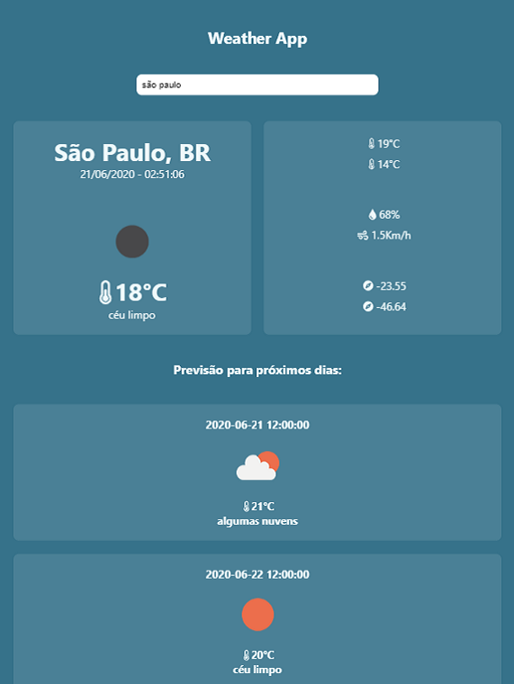

# weather-app 
Aplicação para visualizar dados climáticos das cidades

--------------------------------------------------------------

**
 DESKTOP 
**

 

 
**
 MOBILE 
**

--------------------------------------------------------------
